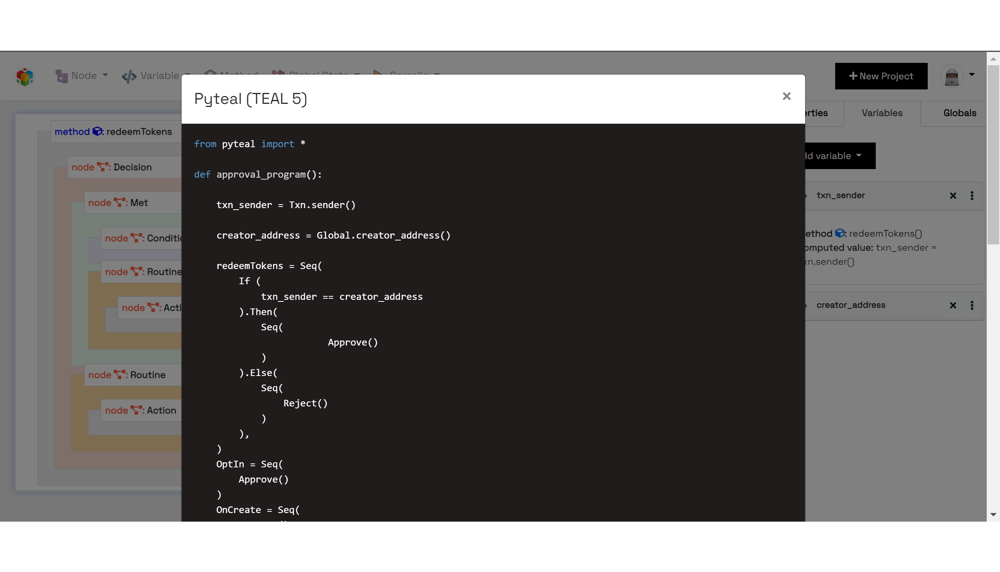

.. _compiling:

Compiling
=====================

The GUI workflow can be converted to a JSON schema or Pyteal source code.

When the "Export JSON schema" button is clicked, a JSON file is downloaded, called asc-builder.json, which can be imported to create another project with the same data.

A typical Pyteal source code result would appear thus:

The code can be copied to clipboard and then executed to generate TEAL code.