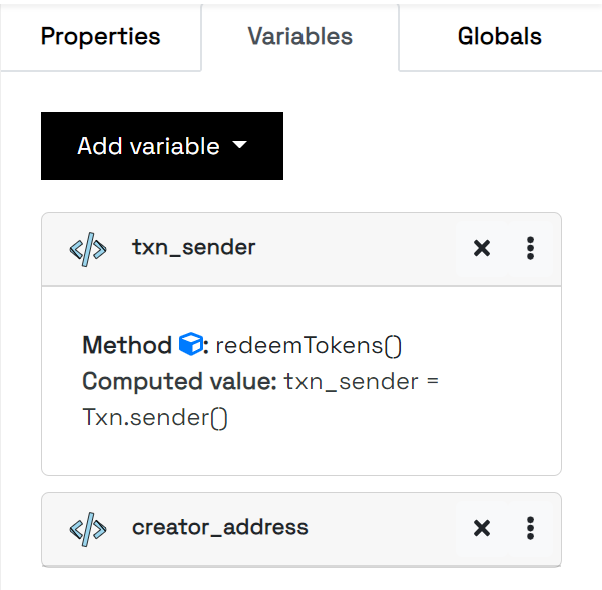
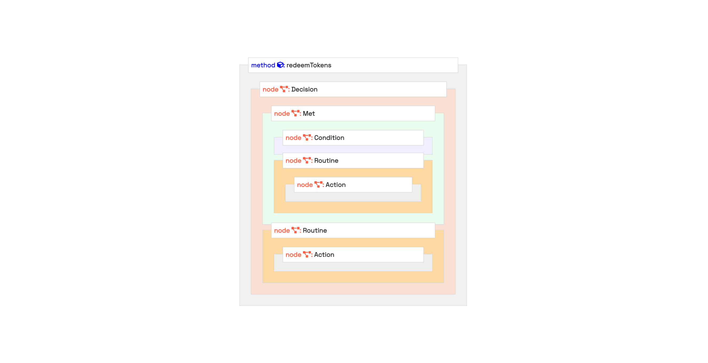

.. _control_flow:

Control Flow
=====================

In every application, we have a way in which logic can be designed. In this sense, ASC Builder can be used to create a logical expression such as an :code:`If` statement which uses comparative operators and performs actions when due according to conditions met or not met.

The structure is thus:

::
    
    Decision Node
    ├── Met Node
    │   ├── Condition Node
    │   ├── Routine Node
    │   │   ├── Action Node
    ├── Routine Node
    │   ├── Action Node

A typical illustration of a decision statement would be to create two variables such as txn_sender and creator_address thus:

We may want to check if the transaction sender is the creator of the smart contract and approve if that is the case or reject if that is not the case.

To do this, we follow these steps:

1. Create a Decision node
2. Create a Met node and add it to the Decision node.
3. Create a Routine node and add it to the Decision node.
4. Add a Condition node to the Met node, which has the first operand as :code:`txn_sender`, second operand as :code:`creator_address` and the operator as :code:`Is Equal to`.
5. Add a Routine to the Met node.
6. Add an Action to the just added Routine with :code:`Approve Transaction`.
7. Add an Action node to the Routine directly nested in the Decision node with :code:`Reject Transaction`.

The resulting GUI would appear thus:

The structure of a decision **MUST** follow the following pattern.

You can watch the video in this `Tweet <https://twitter.com/Algoknox/status/1540468431228751872>`_ to see how this is done.