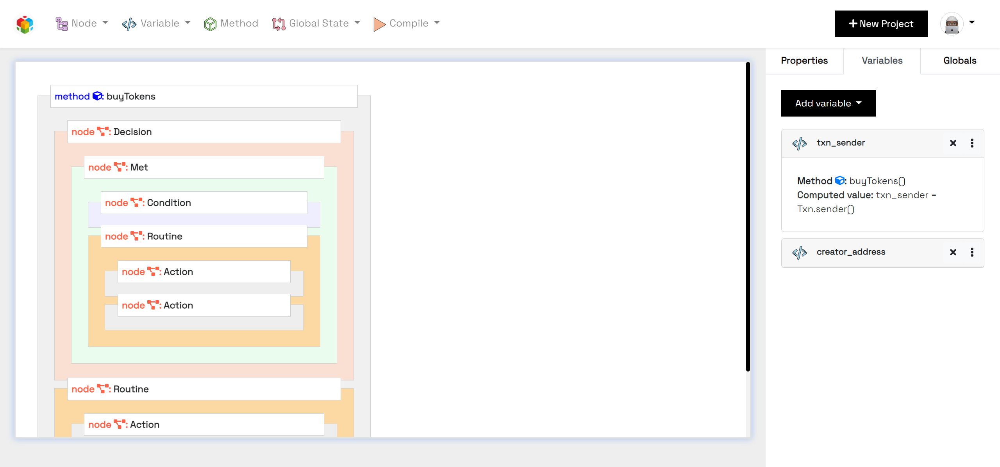

ASC Builder: A GUI tool for creating Algorand Smart Contracts
=============================================================

**ASC Builder** is a drag-and-drop GUI tool that makes it possible for developers to create Pyteal source code that can in turn be compiled to TEAL smart contracts by the use of UI widgets, actions and configurations that specify their behaviours.

The aim of the project is to make the development of smart contracts easier and provide an open and shared workflow that features exports and imports of projects via JSON schemas.

It also helps in preventing unforseen errors when constructing nodes, methods and actions.

.. toctree::
   :maxdepth: 1
   :caption: User Guide

   methods
   variables
   nodes
   control_flow