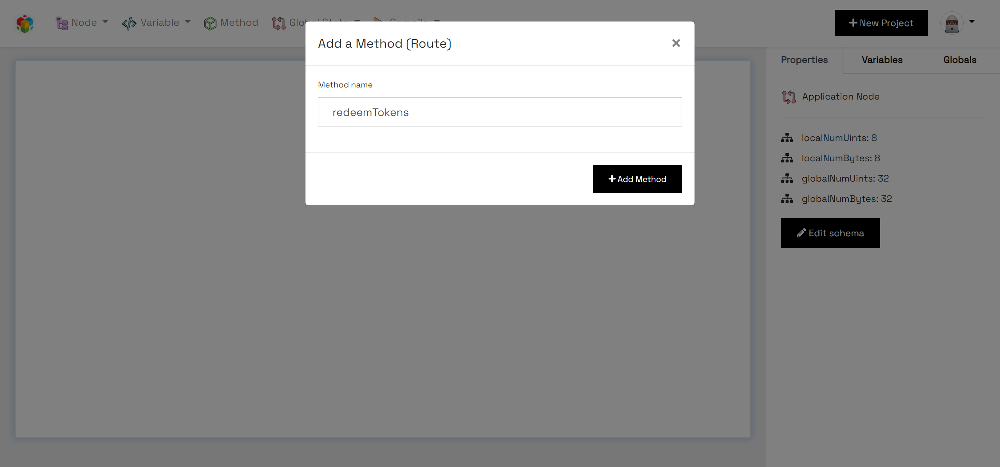

.. _methods:

Methods
=====================

A method (or route) can be added to the GUI by clicking on the 'Method' menu item at the top-right part of the screen.

You then have to provide the name of the method, which **MUST** be named with the variable naming standards as used in Python.

For instance; if a method for sending tokens to the caller of the smart contracts is to be created, you can use a name such as

**redeemTokens** or **redeem_tokens** or **RedeemTokens**

`Method names must not begin with numbers!`

Furthermore, a Method cannot be added to another Method.