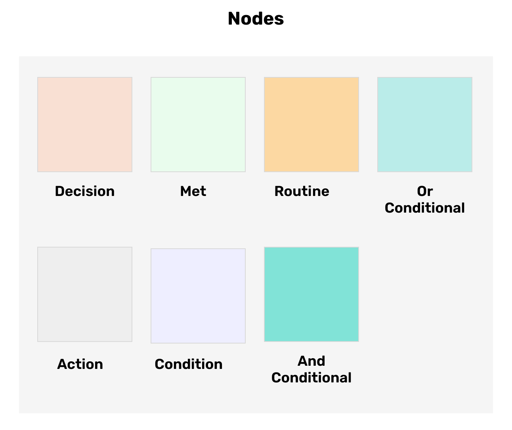

.. _nodes:

Nodes
=====================

A Node is a component that represents a flow in the GUI program. It can be used to define the structure and behaviour of a method in your smart contract.

Each Node has a special color attributed to it to enable easy differentiation and streamlining.

There are quite number of nodes that can be used in ASC Builder, which are as follows:

Decision
---------------------
A Decision node is a wrapper for the :code:`If` statement and helps to construct logical decisions. A typical decision Node consists of a Met node and a Routine node.

Met
---------------------
A Met node is a used to specify a condition or set of conditions (And Conditional, Or Conditional) and an action or group of actions to be performed when met.

Routine
---------------------
A Routine node is used to specify an action or set of actions to be performed in your smart contract.

Or Conditional
---------------------
An Or Conditional node is used to specify a set of conditions in such a way that at least one of any of the conditions must be met for it to be valid.

And Conditional
---------------------
An And Conditional node is used to specify a set of conditions in such a way that all of the conditions must be met for it to be valid.

Action
---------------------
An Action node is used to perform an operation such as an asset transfer, approval, rejection, etc. in your smart contract.
Some examples of actions are:

1. Send $ALGO 
2. Send an ASA
3. Opt-in ASA
4. Write Global State
5. Write Local State
6. Remove Global State
7. Remove Local State
8. Approve Transaction
9. Reject Transaction

Condition
---------------------
A condition node is a single comparative expression that is used in a Met node, And Conditional or Or Conditional node.