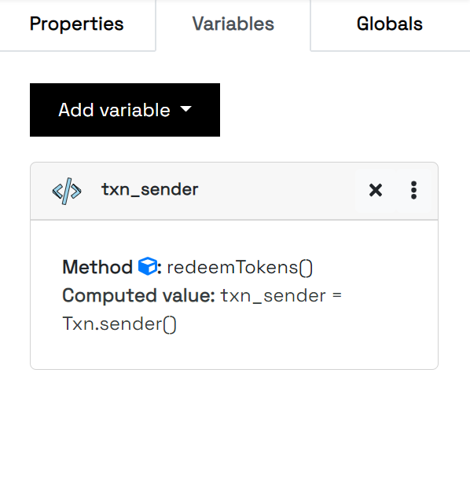

.. _variables:

Variables
=====================

There are many variables that can be added to the GUI that help to hold different values that range from Transaction properties to Integers, Byte Slices and many more.

Variables that are created are added to the Variables side panel at the right-hand side of the screen. To create a variable, you specify the variable name and construct its value from the UI.

There are a total of `18` variables that can be created thus;

Address
---------------------
An Address variable is meant to hold a valid Algorand Address. There are many options that can be chosen as values for the Address variable and are selected from a dropdown.

=================================== ==============================================================================================================================================================================================
Name                                Description   
=================================== ==============================================================================================================================================================================================
Address                             This is used to specify a 58-character Algorand address that you intend to be stored in the variable. It's a string representation of a valid address.
Creator Address                     This represents the Address of the creator of the smart contract. Equivalent to :code:`Global.creator_address()` in Pyteal.
Current Application Address         This represents the Escrow account attributed to the smart contract. Equivalent to :code:`Global.current_application_address()`.
Accounts                            This is used to provide a positive integral index in an array of accounts specified in the Application Call. Equivalent to :code:`Txn.accounts[]` in Pyteal.
Sender                              This represents the caller (sender) of the transaction. Equivalent to :code:`Txn.sender()`.
Receiver                            This represents the receiver of a Payment transaction. Equivalent to :code:`Txn.receiver()`.
Asset Receiver                      This represents the receiver of an AssetTransfer transaction. Equivalent to :code:`Txn.asset_receiver()`.
=================================== ==============================================================================================================================================================================================

Asset
---------------------
An Asset variable is meant to hold an asset index that can be used for an asset transfer or any other ASA operation. There are two means of specifying the value of this variable:

=================================== ==============================================================================================================================================================================================
Name                                Description   
=================================== ==============================================================================================================================================================================================
Asset Index                         This is used to specify the ASA ID of the asset for any Asset operation.
Assets                              This is used to specify an positive integral index in the assets provided in the Application Call.
=================================== ==============================================================================================================================================================================================

Byte String
---------------------
A Byte String variable is meant to provide a string variable in the application.
It result to :code:`Bytes()` in Pyteal.

Integer
---------------------
An Integer variable is meant to provide a positibe numeric variable in the application.
It results to :code:`Int()` in Pyteal.

Asset Holding
---------------------
An Asset Holding variable is meant to provide the balance of an asset ($ALGO or ASA) of a specified Algorand address.
You also specify the account in question as a variable (most specifically an Address variable) whose balance should be gotten for the given asset.

Possible choices for the target asset are:

=================================== ==============================================================================================================================================================================================
Name                                Description   
=================================== ==============================================================================================================================================================================================
$ALGO                               This is used to get the $ALGO balance of an asset in MicroAlgos.
Asset Index                         This is used to specify the Integral value of the ASA in which to get the account's balance for.
Variable Name                       This is used to specify a variable name that contains the ASA in question.
=================================== ==============================================================================================================================================================================================

Min Balance
---------------------
A Min Balance variable is meant to get the minimum possible balance of an Algorand account.
The required parameter to provide is a variable that holds the Account whose minimum balance should be retrieved.
Equivalent to :code:`MinBalance()` in Pyteal.

Asset Decimals
---------------------
An Asset Decimals variable is meant to get the decimals of an asset as an integral value such as `0`, `1`, `2` etc.
The parameter provided is either an Asset Index or a variable that holds the ASA ID of the asset whose decimals you want to get.
Equivalent to :code:`AssetParams.decimals()` in Pyteal.

Argument
---------------------
An Argument variable is used to get a 1-indexed value in the array of arguments provided in the Application Call.
Equivalent to :code:`Txn.application_args[]` in Pyteal.

Application
---------------------
An Application variable is used to represent an application ID.
Possible values that can be provided are a 1-indexed index in the list of applications (:code:`Txn.applications[]`) provided in the Application Call or an integral value for the application ID (Note that it must still be in the list of applications).

Transaction Field
---------------------
A Transaction Field variable is used to represent a transaction field such as sender, fee, receiver etc.

Grouped Transaction Field
---------------------
A Grouped Transaction Field variable is used to represent a field in a grouped transaction.
The group index and the field are values that should be provided for this variable.

Miscellaneous
---------------------
A Miscellaneous variable is used to create variables that perform special transforms to variables such as arithmetic operations, ByteSlice manipulation and type casting.

Local State
---------------------
A Local State variable is used to hold a local state key from a specified Algorand account. Equivalent to :code:`App.localGet()`

Global State
---------------------
A Global State variable is used to hold a global state value in the application. Equivalent to :code:`App.globalGet()`

External Local State
---------------------
An External Local State variable is used to hold a local state value for an Algorand account in an external application whose ID is provided. Equivalent to :code:`App.localGetEx()`

External Global State
---------------------
An External Global State variable is used to hold a global state value in an external application whose ID is provided. Equivalent to :code:`App.globalGetEx()`

Global Field
---------------------
A Global Field variable is used to hold a :code:`Global` value such as the latest timestamp, creator address and many others.

Transaction Type
---------------------
A Transaction Type variable is used to hold a value that represents a type for a transaction, which can be used for comparison to the :code:`type_enum()` field of a transaction.